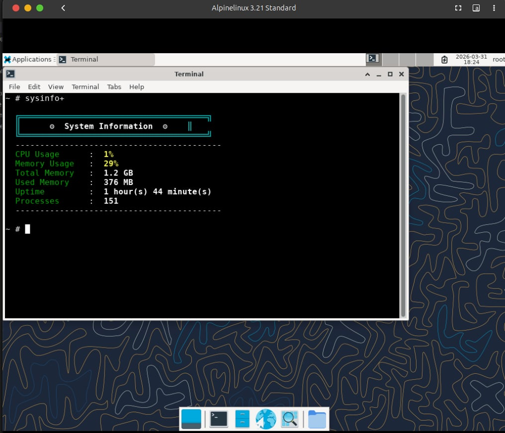
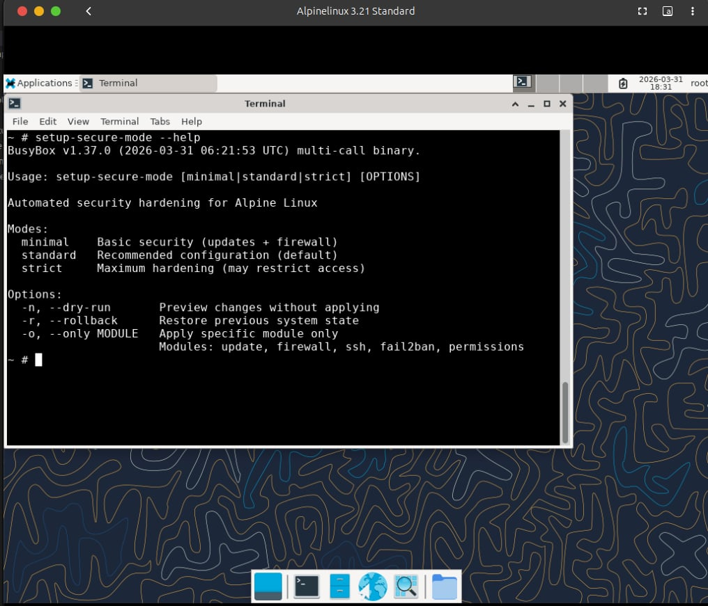
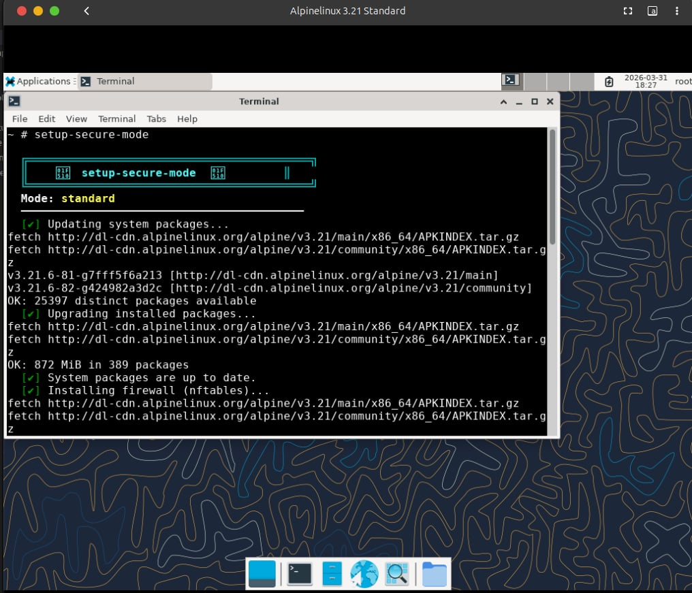
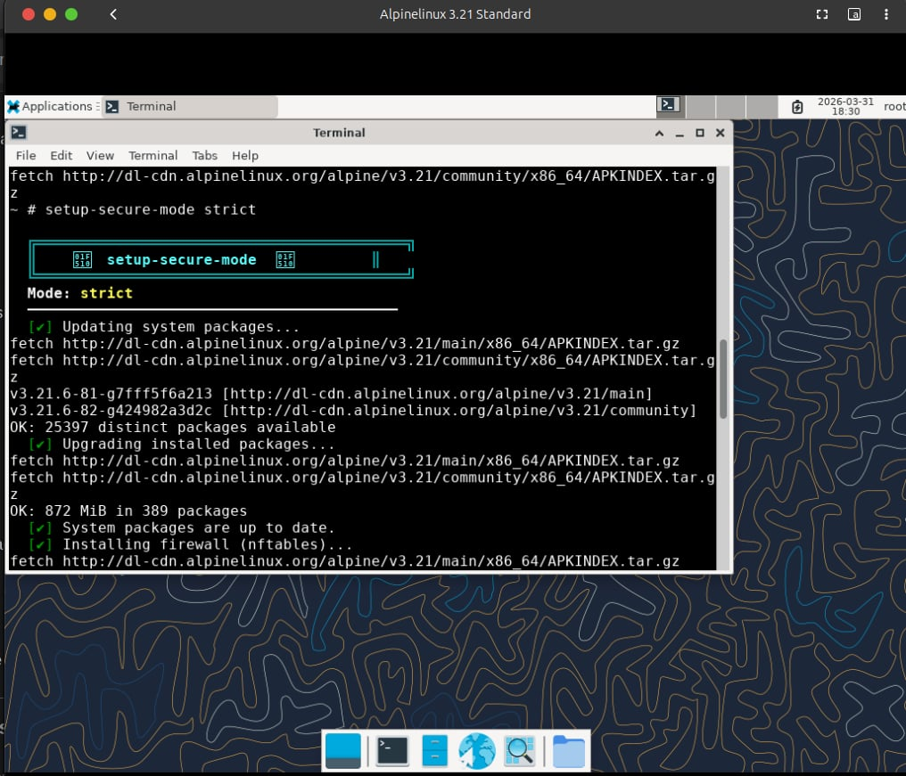

# Alpine Linux: A Case Study

## Introduction
This case study explores **Alpine Linux**, a lightweight and security-oriented Linux distribution. Known for its **minimal footprint** and **high efficiency**, Alpine Linux is widely used in **containerized environments** and **embedded systems**.

## Features Analyzed
- **Lightweight Design**: Uses `musl libc` and `BusyBox` for minimal resource consumption.
- **Security-Focused**: Employs a **hardened kernel** with strong security policies.
- **Containerization**: Popular in Docker and Kubernetes for its **5MB base image**.
- **Package Management**: Uses `apk` (Alpine Package Keeper) for efficient package management.
- **Multiple Installation Modes**:
  - Live Mode
  - Persistent Mode
  - RAM-Only Mode
  - Docker-Based Installation

## Installation & Usage Guide

This project leverages Docker to build a customized Alpine environment and distribute the security payload to a virtual machine (if testing on GNOME Boxes or VirtualBox).

### 1. Clone the Repository
First, clone the project to your local machine:
```bash
git clone https://github.com/manishh101/alpine-case-study.git
cd alpine-case-study
```

### 2. Build and Run the Docker Environment
The Docker container compiles our customized BusyBox applets (`setup-secure-mode` and `sysinfo+`) and hosts a local HTTP server to distribute these binaries to your Alpine VM.

```bash
# Build the custom Alpine image
docker build -t alpine-os .

# Run the container (exposes port 8080 for the payload HTTP server)
docker run -p 8080:8080 -d alpine-os
```

### 3. Deploying to an Alpine VM (Optional)
If you are running a fresh Alpine Linux installation (e.g., via GNOME Boxes) and want to apply these custom security modules, you can securely pull the payload from your Docker host.

Inside your Alpine VM, run:
```bash
# Replace <HOST_IP> with your Docker host's local IP address
wget http://<HOST_IP>:8080/Desktop/install-secure-mode.sh
chmod +x install-secure-mode.sh
./install-secure-mode.sh
```

### 4. Running the Tools
Once installed (either natively in the Docker shell or on your VM), you can instantly use the new commands:
- Run `sysinfo+` to view real-time system metrics.
- Run `setup-secure-mode --help` to view security hardening options.
## Custom Modifications
### Graphical User Interface (GUI)
Installed **XFCE** for a minimal desktop environment, enhancing usability while keeping resource consumption low.


### File Sharing Setup
Configured a custom **HTTP-based file transfer** solution for seamless file sharing between host and VM.


### Custom ISO
Created an Alpine-based **custom ISO** with pre-installed tools and configurations.


### Enhanced System Info (sysinfo+)
A custom **native BusyBox applet** written in C that provides a high-performance, colorized dashboard of system metrics. Instead of relying on slow shell scripts, it reads directly from `/proc` to display:
- **CPU & Memory Usage:** Real-time percentage and total/used values.
- **System Uptime & Processes:** Formatted uptime and running process count.



### Security Hardening (setup-secure-mode)
A **native BusyBox applet** that automates system security hardening with three modes:



```bash
setup-secure-mode              # Apply standard (default) security config
setup-secure-mode minimal      # Basic: updates + firewall only
setup-secure-mode standard     # Recommended: + SSH hardening + fail2ban
setup-secure-mode strict       # Maximum: + disable password auth

# Safety options
setup-secure-mode --dry-run    # Preview changes without applying
setup-secure-mode --rollback   # Restore previous configuration
setup-secure-mode --only ssh   # Apply single module only
```

**Security modules included:**
| Module | Description |
|--------|-------------|
| `update` | System package updates |
| `firewall` | nftables rules (allow SSH, block incoming) |
| `ssh` | SSH hardening (disable root login, key-only in strict) |
| `fail2ban` | Intrusion prevention (ban after failed logins) |
| `permissions` | Secure file permissions (.ssh, authorized_keys) |

#### Modes in Action

**Standard Mode:** Focuses on a balanced security approach, enabling firewall, updating the system, applying SSH hardening, and integrating `fail2ban`.


**Minimal Mode:** A lighter touch that only handles system updates and basic firewall rules.


**Strict Mode:** Enforces maximum security, disabling password-based authentication in favor of key-only access to prevent brute force attacks alongside other standard protections.


All operations are logged to `/var/log/secure-mode.log` with automatic backups in `/var/backups/secure-mode/`.

## Use Cases
- **Containerization**: Ideal for lightweight, scalable deployments.
- **Embedded Systems**: Suited for low-resource environments.
- **Development & Testing**: Great for minimalistic system design.

## Conclusion
Alpine Linux stands out as a **secure, lightweight, and efficient** OS. While it excels in containerized and resource-constrained environments, its **unconventional design** (musl instead of glibc) poses challenges for some users. Through our customizations, we made Alpine Linux more accessible while retaining its core strengths.

## References
- [Alpine Linux Official Documentation](https://alpinelinux.org/)
- [XFCE Desktop Environment](https://xfce.org/)
- [How to Create a Custom Alpine ISO](https://wiki.alpinelinux.org/wiki/How_to_make_a_custom_ISO_image_with_mkimage)
